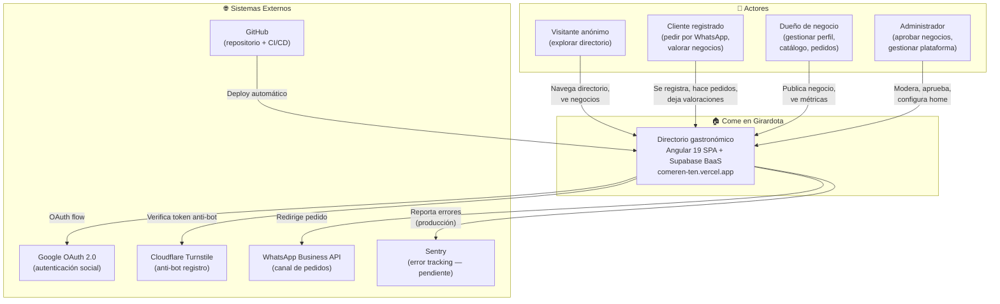
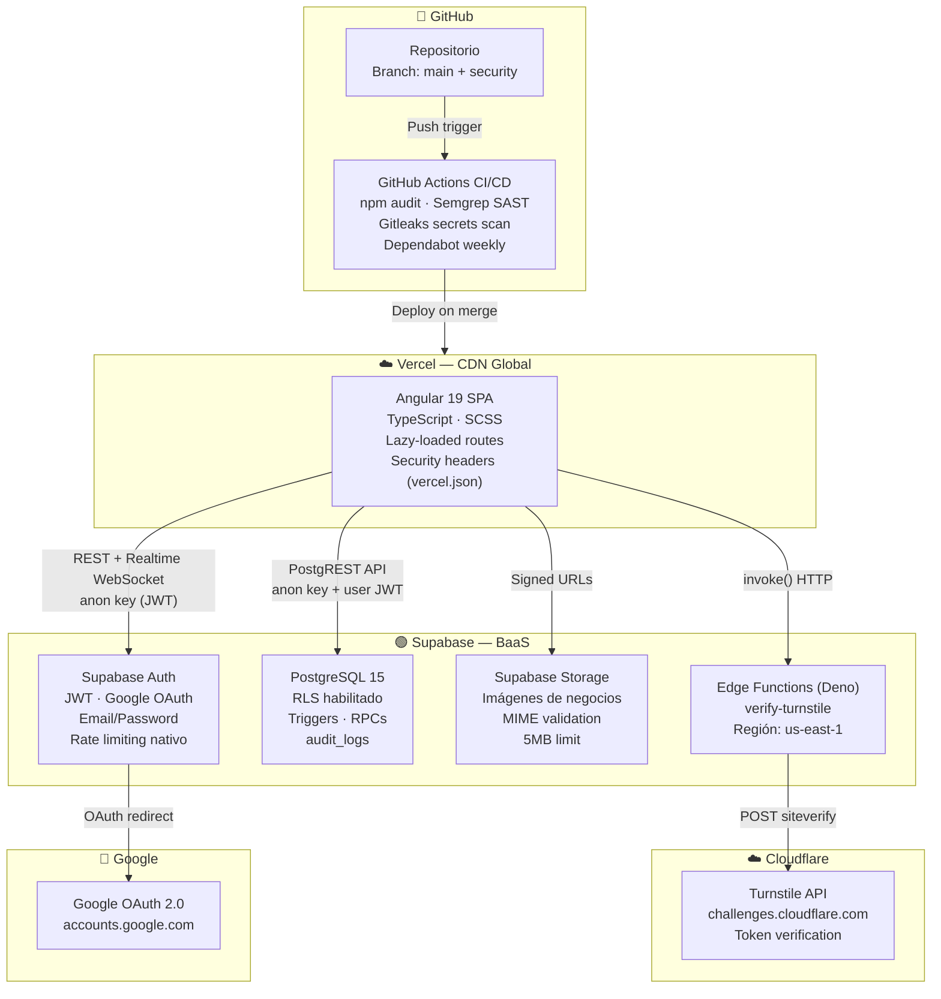
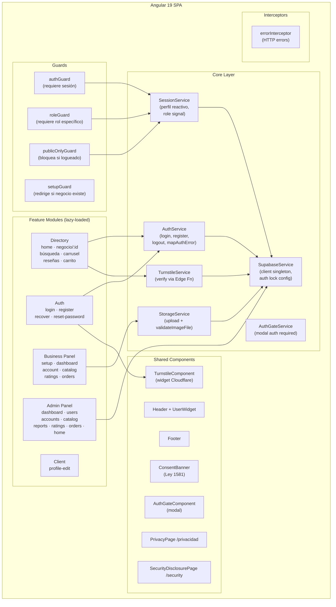
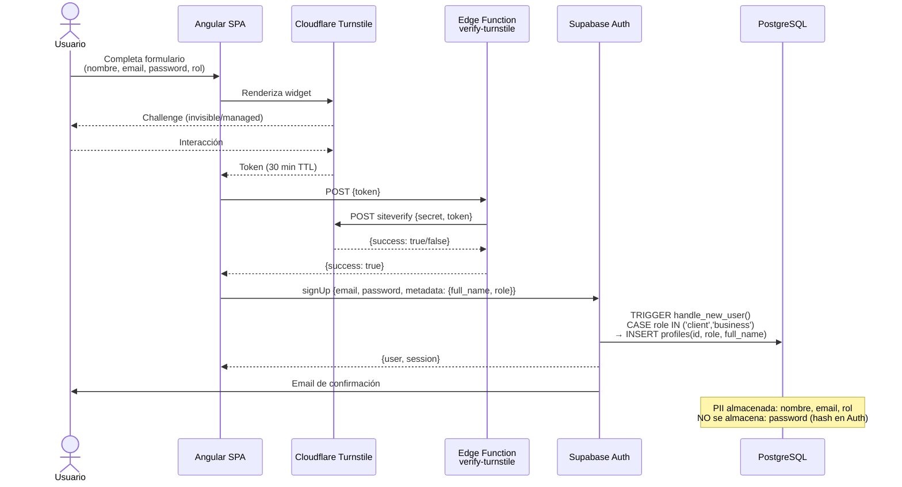
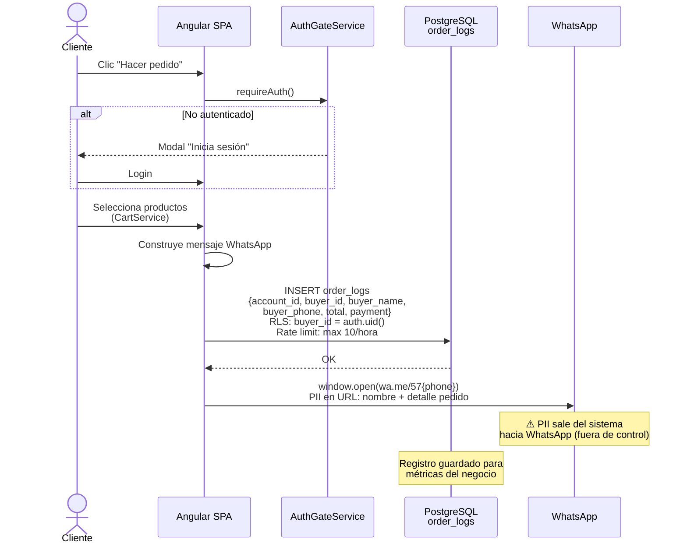
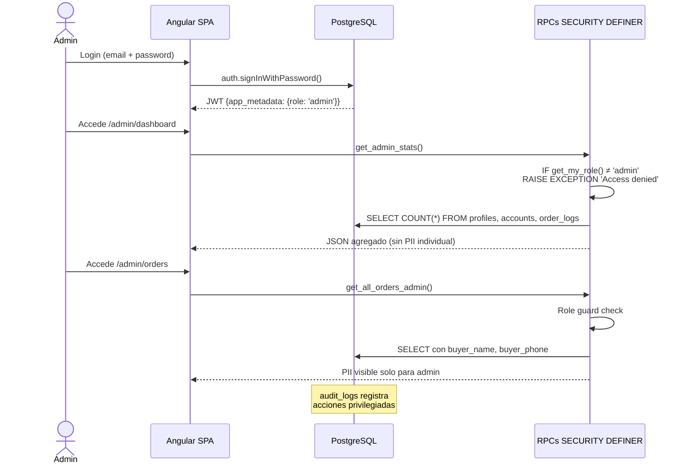
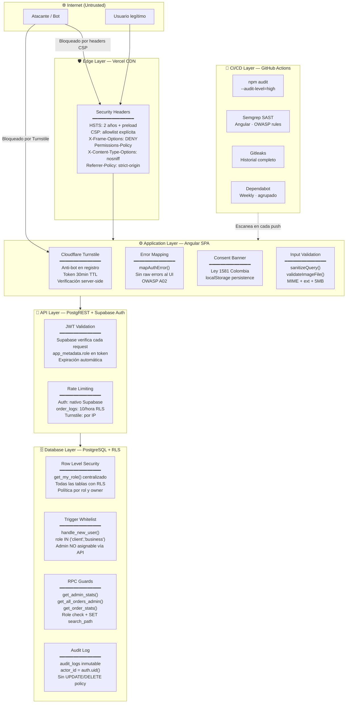
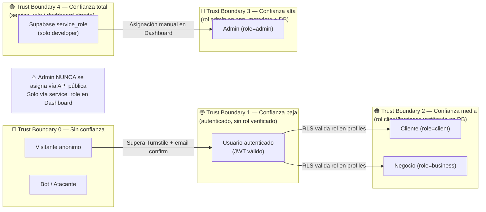
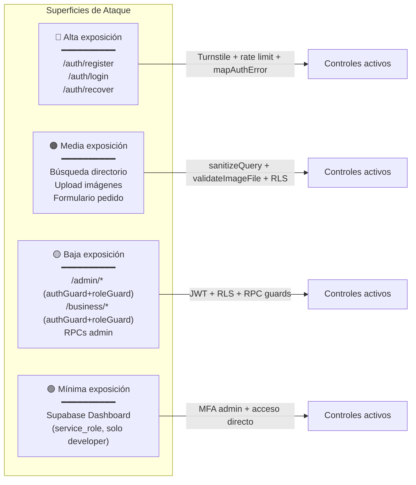
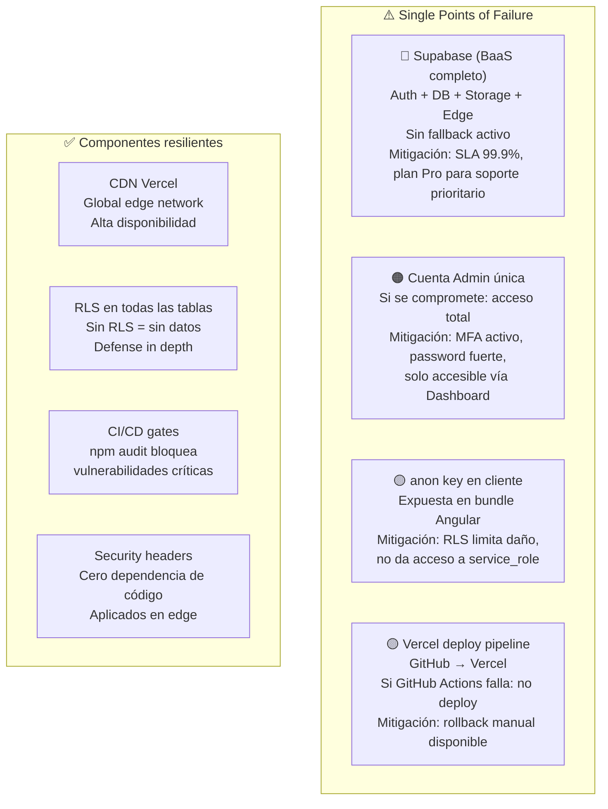

# Architecture Board Pack — Come en Girardota
**Versión:** 1.0 | **Fecha:** 2026-04-26 | **Autor:** Juan Pablo Velásquez / Claude Sonnet 4.6
**Stack:** Angular 19 · Supabase · Vercel · Cloudflare · GitHub Actions

---

## Índice

1. [System Context Diagram (C4-L1)](#1-system-context-diagram-c4-l1)
2. [Container Diagram (C4-L2)](#2-container-diagram-c4-l2)
3. [Component Diagram (C4-L3)](#3-component-diagram-c4-l3)
4. [Data Flow Diagram — PII y Órdenes](#4-data-flow-diagram--pii-y-órdenes)
5. [Security Architecture Diagram](#5-security-architecture-diagram)
6. [Trust Boundary / STRIDE Threat Model](#6-trust-boundary--stride-threat-model)
7. [Resiliencia y Recovery](#7-resiliencia-y-recovery)
8. [Puntos Críticos y Single Points of Failure](#8-puntos-críticos-y-single-points-of-failure)

---

## 1. System Context Diagram (C4-L1)

> Visión de 30.000 pies. El sistema en relación con sus usuarios y sistemas externos.



---

## 2. Container Diagram (C4-L2)

> Tecnologías y responsabilidades de cada contenedor del sistema.



---

## 3. Component Diagram (C4-L3)

> Internos del contenedor Angular SPA.



---

## 4. Data Flow Diagram — PII y Órdenes

### 4.1 Flujo de Registro (PII sensible)



### 4.2 Flujo de Pedido por WhatsApp (PII en tránsito)



### 4.3 Flujo de Acceso Admin (datos sensibles)



---

## 5. Security Architecture Diagram

> Controles de seguridad implementados por capa.



---

## 6. Trust Boundary / STRIDE Threat Model

### 6.1 Trust Boundaries



### 6.2 STRIDE Threat Matrix

| ID | Amenaza (STRIDE) | Componente | Mitigación implementada | Riesgo residual |
|----|---|---|---|---|
| T-01 | **S** Spoofing — Impersonar otro usuario | Auth / JWT | JWT firmado por Supabase, expiración automática | Bajo |
| T-02 | **S** Spoofing — Registro como admin | `handle_new_user()` | CASE whitelist: solo `client`/`business` asignables | Muy bajo |
| T-03 | **S** Spoofing — Cuenta comprometida | Auth | Password mínimo 8 chars, rate limiting nativo, MFA admin | Medio |
| T-04 | **T** Tampering — Modificar datos de otro usuario | PostgreSQL | RLS: `owner_id = auth.uid()` en todas las tablas | Bajo |
| T-05 | **T** Tampering — Inyección en búsqueda | DirectoryService | `sanitizeQuery()`: trim, maxLength(100), strip `(),'` | Bajo |
| T-06 | **T** Tampering — Upload de archivo malicioso | StorageService | `validateImageFile()`: MIME + ext + 5MB | Bajo |
| T-07 | **R** Repudiation — Negar acción de pedido | `order_logs` | `buyer_id = auth.uid()`, timestamp inmutable, audit_logs | Bajo |
| T-08 | **R** Repudiation — Negar acción de admin | `audit_logs` | Sin política UPDATE/DELETE, actor_id registrado | Bajo |
| T-09 | **I** Information Disclosure — Raw errors al UI | AuthService | `mapAuthError()`: 12 patrones mapeados, fallback genérico | Muy bajo |
| T-10 | **I** Information Disclosure — PII en órdenes admin | RPCs | Role guard en `get_all_orders_admin()`, `get_order_stats()` | Bajo |
| T-11 | **I** Information Disclosure — Secrets en repo | Git / CI | Gitleaks historial completo, `.gitignore` env files | Muy bajo |
| T-12 | **D** Denial of Service — Spam en order_logs | RLS WITH CHECK | Rate limit: 10 inserts/hora por `auth.uid()` | Bajo |
| T-13 | **D** Denial of Service — Abuso de registro | Auth + Turnstile | Turnstile server-side + rate limiting Supabase Auth | Bajo |
| T-14 | **D** Denial of Service — Clickjacking | Headers | `X-Frame-Options: DENY`, `CSP: frame-ancestors 'none'` | Muy bajo |
| T-15 | **E** Elevation of Privilege — Escalar a admin vía API | Trigger + RLS | Whitelist en trigger, admin solo vía Dashboard | Muy bajo |
| T-16 | **E** Elevation of Privilege — RPC bypass | RPCs | `get_my_role()` check al inicio, `SET search_path = public` | Muy bajo |
| T-17 | **E** Elevation of Privilege — Dep. vulnerable | npm packages | Dependabot semanal, `npm audit` en CI | Medio |

### 6.3 Attack Surface Map



---

## 7. Resiliencia y Recovery

| Escenario | Impacto | Tiempo de detección | Procedimiento de recovery |
|---|---|---|---|
| **Supabase down** | 100% — app inaccesible | Inmediato (Supabase Status Page) | Esperar SLA Supabase (99.9% uptime). No hay failover activo. |
| **Vercel down** | 100% — SPA inaccesible | Inmediato | Vercel CDN redundante globalmente. SPOF bajo. |
| **Corrupción de datos** | Alto | Manual (revisión de soporte) | Backup manual antes de cada migración. Pro plan para PITR. |
| **Secret expuesto** | Crítico | Gitleaks en CI / manual | Rotar con `supabase secrets set`. Rotar anon key en Dashboard. |
| **Cuenta admin comprometida** | Crítico | Manual | Ban user en Auth. Revocar sesiones. Reasignar rol vía service_role. |
| **Dependency vulnerable** | Medio | Dependabot PR / npm audit CI | Merge Dependabot PR. `npm audit fix`. |
| **Deploy roto** | Alto | Vercel build log | Rollback en Vercel Dashboard → Deployments → Redeploy anterior. |

### Recovery Time Objectives (RTO)

| Escenario | RTO objetivo | Método |
|---|---|---|
| Deploy roto | < 5 min | Rollback Vercel 1-click |
| Secret comprometido | < 15 min | CLI: `supabase secrets set` |
| Cuenta admin comprometida | < 30 min | Dashboard: ban + reassign |
| Corrupción de datos | < 4 horas | Restore desde backup manual |
| Supabase outage | Dependiente de Supabase SLA | Espera + status.supabase.com |

---

## 8. Puntos Críticos y Single Points of Failure



### Matriz de riesgo residual

| Componente | Probabilidad | Impacto | Riesgo | Acción |
|---|---|---|---|---|
| Supabase outage | Baja | Crítico | **Medio** | Monitorear status page |
| Cuenta admin comprometida | Muy baja | Crítico | **Medio** | MFA activo ✅ |
| Dependency crítica | Media | Alto | **Medio** | Dependabot + CI audit ✅ |
| Breach de datos | Muy baja | Crítico | **Bajo** | RLS + guards + audit_logs ✅ |
| Deploy roto | Baja | Alto | **Bajo** | Rollback 1-click Vercel ✅ |
| Bot abuse registro | Baja | Medio | **Muy bajo** | Turnstile server-side ✅ |
| XSS / Clickjacking | Muy baja | Alto | **Muy bajo** | CSP + X-Frame-Options ✅ |
| Privilege escalation | Muy baja | Crítico | **Muy bajo** | Trigger whitelist + RPC guards ✅ |

---

## Resumen ejecutivo

El sistema implementa **defense in depth** en 5 capas independientes. Un atacante necesita comprometer simultáneamente múltiples controles para causar daño significativo:

```
Internet → [Headers CSP/HSTS] → [Turnstile anti-bot] → [JWT Auth]
        → [RLS por rol] → [RPC guards] → [Trigger whitelist] → datos
```

**Fortalezas del diseño:**
- Supabase RLS como red de seguridad final: incluso con un bug en el frontend, los datos no son accesibles sin el rol correcto
- Admin nunca asignable vía API pública — requiere acceso directo al Dashboard
- Security headers aplicados en edge, sin dependencia del código Angular
- CI/CD bloquea vulnerabilidades críticas antes de llegar a producción

**Riesgo principal a gestionar:**
- Dependencia total en Supabase como BaaS único — sin failover activo. Aceptable para etapa inicial; evaluar redundancia si el negocio escala a nivel que justifique el costo.
